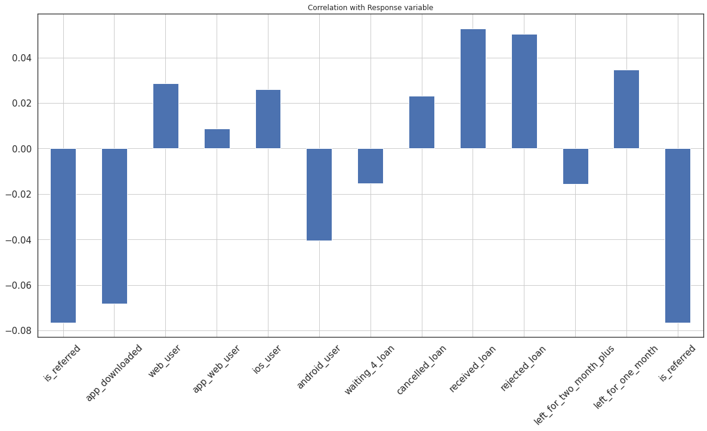
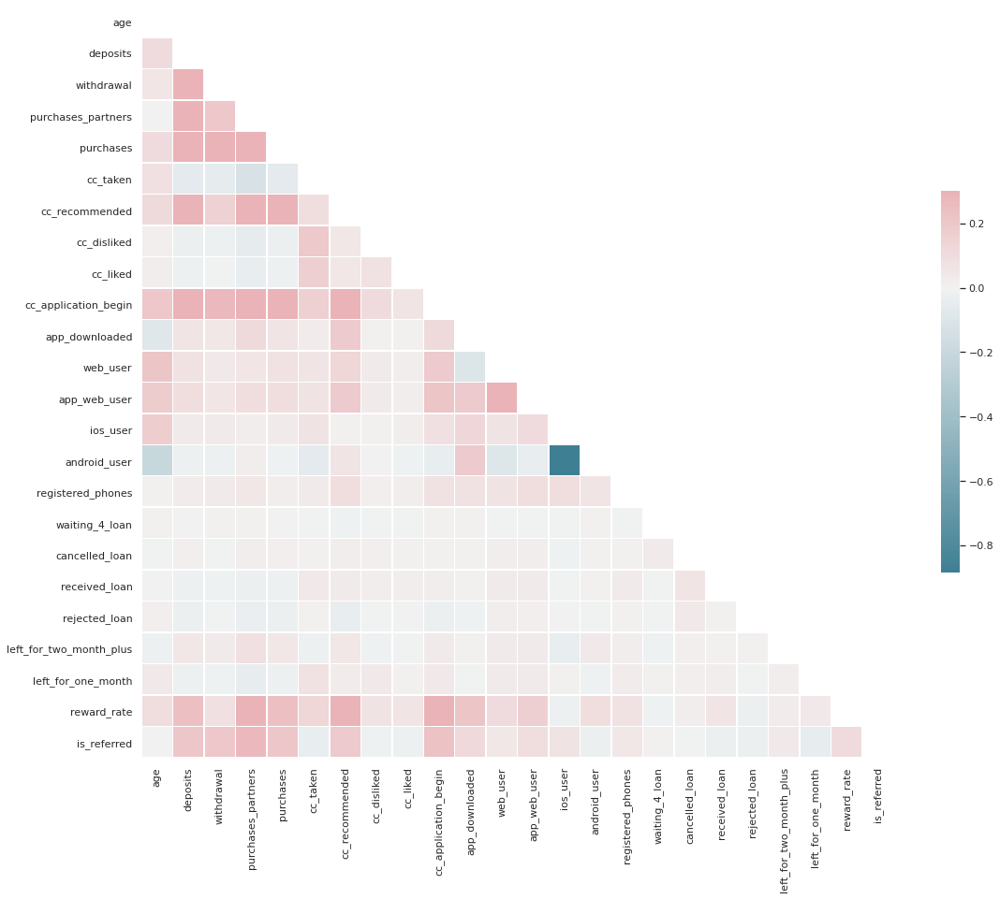

# Minimize_chrun_rate

Minimizing Churn Rate Through Analysis of Financial Habits

# Table of Content
1. [Project Overview](#project)
2. [Business Challenge](#Business_Challenge)
3. [Dataset Overview](#dataset)
4. [Steps](#steps)
5. [Model Choose](#model)

<a name="project"></a>
## Project Overview

Subscription Products often are the main source of revenue for companies across all industries. These products can come in the form of a 'one size fits all' overcompassing subscription, or in multi-level memberships. Regardless of how they structure their memberships, or what industry they are in. companies almost always try to minimize customer churn (a.k.a. subscription cancellations). To retain their customers, these companies first need to identify behavioral patterns that act as catalyst in disengagement with the product.

- __market__:The target audience is the entirety of a company's subscription base. They are the ones companies want to keep. 
- __Product__: The subscription products that customers are already enrolled in can provide value that users may not have imagined, or that they may have forgotten. 
- __Goal__:The objective of this model is to predict which users are likely to churn, so that the company can focus on re-engaging these users with the product. These efforts can be email reminders about the benefits of the product, especially focusing on features that are new or that the user has shown to value. 


<a name="Business_Challenge"></a>
## Business Challenge
- In this Case Study we will be working for a fintech company that provides a subscription product to its users,which allows them to manage their bank accounts (saving accounts, credit cards, etc), provides them with personalized coupons, informs them of the latest low-APR loans available in the market, and educates them on the best available methods to save money (like videos onsaving money on taxes, free courses on financial health,etc).

- We are in charge of identifying users who are likely to cancel their subscription so that we can start building new features that they may be interested in. These features can increase the engagement and interest of our users towards “the product.”
<a name="dataset"></a>
## Dataset overview
- By subscribing to the membership, our customers have provided us with data on their finances, as well as how
they handle those finances through the product. We also have some demographic information we acquired from
them during the sign-up process.

- Financial data can often be unreliable and delayed. As a result, companies can sometimes build their marketing
models using only demographic data, and data related to finances handled through the product itself. Therefore,
we will be restricting ourselves to only using that type of data. Furthermore, product-related data is more
indicative of what new features we should be creating as a company.

<a name="steps"></a>
## Steps  
1. Access, Clean and Analyze Data
we wil plot histogram to for Univarient analysis

Now we will se correlation with response variable.

Correlation Matrix


Scaing features
```
# Feature Scaling
from sklearn.preprocessing import StandardScaler
sc_X = StandardScaler()
X_train2 = pd.DataFrame(sc_X.fit_transform(X_train))
X_test2 = pd.DataFrame(sc_X.transform(X_test))
X_train2.columns = X_train.columns.values
X_test2.columns = X_test.columns.values
X_train2.index = X_train.index.values
X_test2.index = X_test.index.values
X_train = X_train2
X_test = X_test2
```
<a name="model"></a>
## Model Choose

I tried logistic regression model to check which model 
#### Model Building ####

```
#### Model Building ####


# Fitting Model to the Training Set
from sklearn.linear_model import LogisticRegression
classifier = LogisticRegression(random_state = 0)
classifier.fit(X_train, y_train)

```


